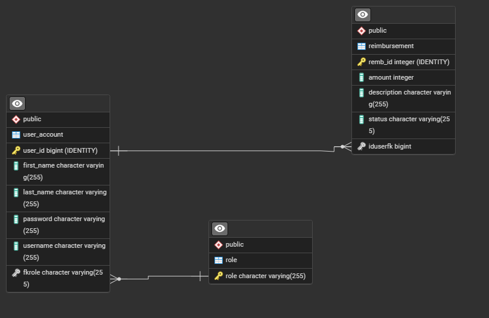

# Project 1 - Employee Reimbursement System

## Project Overview
This project is a Full-Stack application to record and handle employee reimbursement tickets. Employees can create and edit tickets, while managers can approve or deny pending tickets and promote or delete an employee's role in the system.

## User Stories

### Employees
* Create a new account
* Log in to an existing account
* Create a new reimbursement ticket
* See their own tickets
* Edit the amount and description of their own tickets

### Managers
* See all pending reimbursements
* Approve or deny a reimbursement
* See all users
* Delete a user
* Update an employee's role to manager

### Not Logged Users
Users who are not logged in can ONLY:
* Attempt to log in
* Register for a new account

## Tech Stack

### Backend
Java - The most common language for backend development, is compatible with nearly every environment
Spring Boot - A backend framework used for web development. Spring makes dependency injection simple and cuts down on boilerplate code.
Lombok - Generates boilerplate class methods and cuts down on verbose code.
PostGreSQL server

### Frontend

* React - A library for web dev in JavaScript, TypeScript, and many other languages. React gives use componeents which makes parts of writing UI code more simple and scalable.
* TypeScript - A superset of JavaScript that is strongly typed, enforcing type safety earlier in the development life cycle compared to JavaScript. Typescript also gives us additional functionality like interfaces and can be run anywhere that JavaScript can.
* TailwindCSS - A framework for writing CSS directly in React components. Tailwind makes styling far easier since styles are directly in your code.
* TanStack Table - Library that makes building complex tables easy
* TanStack Router - A library that helps with creating links and redirects between components and pages
* TanStack Query - Makes it easy to store the primitive and object-oriented results of HTTP CRUD responses
* Axios - Library for making HTTP requests to backend

## Entity Relationship Diagram

## Challenges
* Creating complicated tables with components coupled to each row requires TanStack Table (or something like it), which has a sharp learning curve.
* Handling the asynchronous nature of HTTP requests and responses can be difficult at first.

## Future Enhancements
* Archival table for reimbursements that belonged to users who have been deleted
* Settings tab where users can change their username or password while still keeping their existing tickets.
